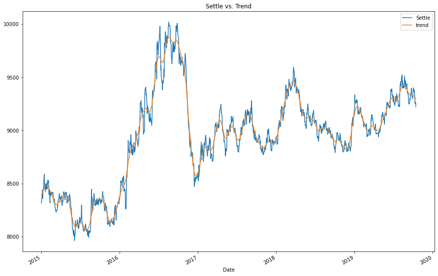
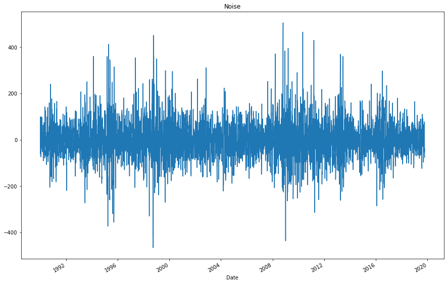
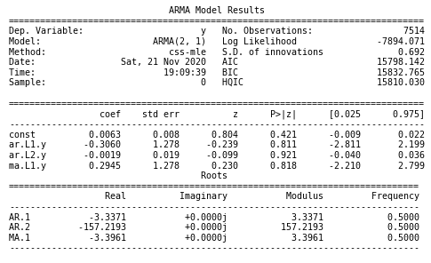
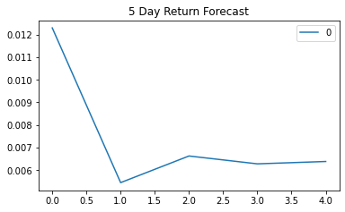
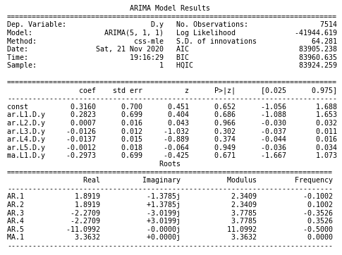
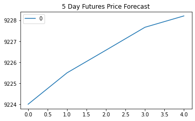
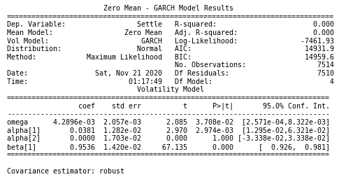
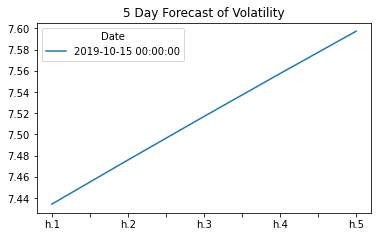
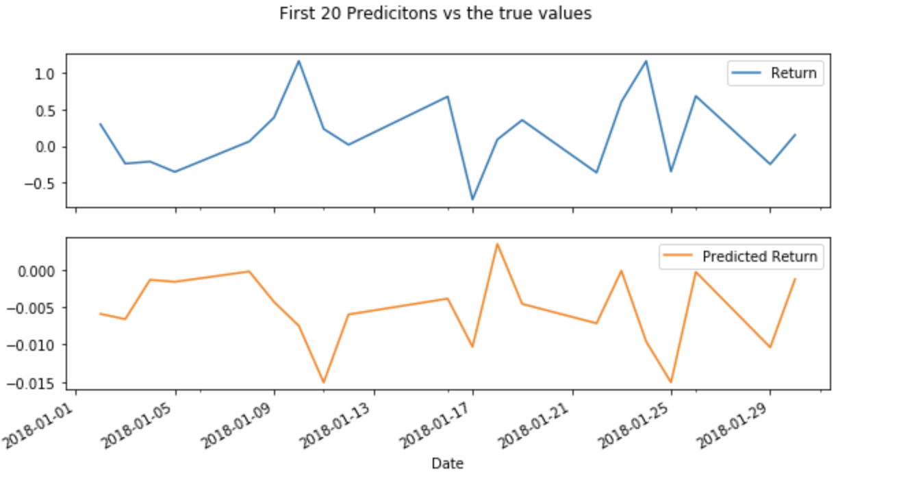

# Unit 10—A Yen for the Future


## Background

The financial departments of large companies often deal with foreign currency transactions while doing international business. As a result, they are always looking for anything that can help them better understand the future direction and risk of various currencies. Hedge funds, too, are keenly interested in anything that will give them a consistent edge in predicting currency movements.

In this assignment, we will test the many time-series tools to predict future movements in the value of the Japanese yen versus the U.S. dollar.

We will gain proficiency in the following tasks:

1. Time Series Forecasting
    * ARMA Model - Forecasting Returns
    * ARIMA Model - Forecasting the Settle Price
    * GARCH - Forecasting Volatatility
2. Linear Regression Modeling

- - -

### Files

[Time-Series Starter Notebook](Starter_Code/time_series_analysis.ipynb)

[Linear Regression Starter Notebook](Starter_Code/regression_analysis.ipynb)

[Yen Data CSV File](Starter_Code/yen.csv)

- - -

### Instructions

#### Time-Series Forecasting

In this notebook, we will load historical Dollar-Yen exchange rate futures data and apply time series analysis and modeling to determine whether there is any predictable behavior.

The steps are outlined in the time-series starter notebook:

1. Decomposition using a Hodrick-Prescott Filter (Decompose the Settle price into trend and noise).

Trend | Noise
:------:|:------:
 | 

2. Forecasting Returns using an ARMA Model.

Summary Report | Forecast Returns
:------:|:------:
 |  

3. Forecasting the Settle Price using an ARIMA Model.

Summary Report | Forecast Settle Price
:------:|:------:
 | 

4. Forecasting Volatility with GARCH.

Summary Report | Forecast Volatility
:------:|:------:
 | 

Use the results of the time series analysis and modeling to answer the following questions:

1. Based on your time series analysis, would you buy the yen now?
> Yes, I will. The ARMA model suggests the return is going to increase in the next five days and the ARIMA model suggests that the Settle price will be higher than today in 5 days. 
2. Is the risk of the yen expected to increase or decrease?
> According to the GARCH model, the volatility has high probability to increase within the next five days. 
3. Based on the model evaluation, would you feel confident in using these models for trading?
> I am not perfectly confident because the models produces AIC and BIC values that are very high. 

#### Linear Regression Forecasting

Afterward, we built a Scikit-Learn linear regression model to predict Yen futures ("settle") returns with *lagged* Yen futures returns and categorical calendar seasonal effects (e.g., day-of-week or week-of-year seasonal effects).

The steps are outlined in the regression_analysis starter notebook:

1. Data Preparation (Creating Returns and Lagged Returns and splitting the data into training and testing data)
2. Fitting a Linear Regression Model.
   
   ```python 
       # Create a Linear Regression model and fit it to the training data
       from sklearn.linear_model import LinearRegression
       # Fit a SKLearn linear regression using just the training set (X_train, Y_train):
       model = LinearRegression()
       model.fit(X_train, y_train)
   ```
    <br> 
3. Making predictions using the testing data.
    ```python
        predictions = model.predict(X_test)
    ```
    <br>


4. Out-of-sample performance.

> Out-of-Sample Root Mean Squared Error (RMSE): 0.4154

5. In-sample performance.

> In-sample Root Mean Squared Error (RMSE): 0.5963

Use the results of the linear regression analysis and modeling to answer the following question:

* Does this model perform better or worse on out-of-sample data compared to in-sample data?

> Both Out-of-Sample and In-Sample performances yeilds good Root-mean-squared error. However, Out-of-Sample model performed better than in-sample model.

- - - 

### Hints and Considerations

* Out-of-sample data is data that the model hasn't seen before (Testing data).
* In-sample data is data that the model was trained on (Training data).

- - -